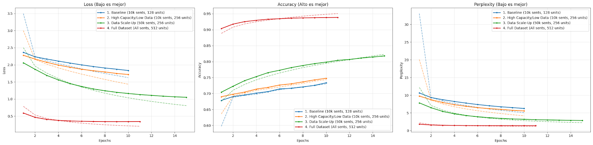

# Portafolio de procesamiento de lenguaje natural

Este repositorio consolida mi trabajo y evolución técnica en la materia de especialización en inteligencia artificial. El proyecto documenta el recorrido desde los fundamentos estadísticos del análisis de texto hasta la implementación de arquitecturas de "Deep Learning" avanzadas para traducción automática.

El objetivo central es demostrar cómo resolver problemas complejos de lenguaje (clasificación, entendimiento semántico y generación) optimizando tanto la precisión de los modelos como el uso de recursos computacionales.

## Tecnologías utilizadas

* **Lenguaje:** Python 3.10+
* **Deep learning:** TensorFlow, Keras (capas funcionales y secuenciales)
* **Procesamiento de datos:** Pandas, Numpy, NLTK
* **Vectorización y ML:** Scikit-learn, Gensim (Word2Vec)
* **Visualización:** Matplotlib, Seaborn

---

## Evolución de los desafíos

### Desafío 1: vectorización y clasificación probabilística

El punto de partida fue entender cómo transformar texto libre en una representación numérica útil. Trabajando con el dataset "20 Newsgroups", el objetivo fue clasificar noticias en categorías temáticas.

**Metodología:**
* Limpieza de texto (eliminación de headers/footers).
* Comparación de técnicas: `CountVectorizer` vs `TfidfVectorizer`.
* Implementación de un modelo Naive Bayes (`ComplementNB`) que demostró ser robusto ante clases desbalanceadas.

### Desafío 2: embeddings y semántica distribuida

Para superar la limitaciones de los vectores dispersos (donde las palabras son islas aisladas), implementé modelos de embeddings propios.

**Hitos técnicos:**
* Entrenamiento de un modelo Word2Vec (Skip-gram) sobre un corpus técnico de telecomunicaciones.
* El modelo logró aprender que "congestion" está semánticamente cerca de "avoidance" y "window", capturando relaciones técnicas sin diccionarios previos.
* Se generaron proyecciones en 2D y 3D (t-SNE) para visualizar estos clusters semánticos.

### Desafío 3: generación de lenguaje con RNNs

Aquí la complejidad aumentó al trabajar con secuencias. El objetivo fue crear un modelo capaz de escribir texto científico carácter por carácter.

**Detalles de implementación:**
* Se compararon arquitecturas `SimpleRNN`, `LSTM` y `GRU`.
* La métrica de **perplejidad** mostró que las celdas con memoria (LSTM/GRU) son indispensables para mantener la coherencia en frases largas.
* Se implementó **Beam Search** para mejorar la fluidez del texto generado, solucionando los bucles repetitivos típicos de la búsqueda voraz (greedy search).

### Desafío 4: traducción automática (Seq2Seq)

El proyecto final consistió en construir un traductor inglés-español utilizando una arquitectura Encoder-Decoder. Este desafío integró todos los conocimientos previos: manejo de embeddings, redes recurrentes y procesamiento de secuencias complejas.

*Figura 2: evolución de la precisión y pérdida durante el entrenamiento del traductor.*

---

## Ingeniería de datos: el uso de DataLoaders

Uno de los aspectos más críticos en proyectos de NLP profesional es el manejo de la memoria RAM. En el **Desafío 4**, trabajar con un vocabulario extenso y secuencias largas hacía inviable cargar todo el dataset en memoria como un array tradicional de Numpy.

Para solucionar esto, implementé un generador de datos personalizado heredando de `tf.keras.utils.Sequence`.

### ¿Por qué es importante?

1.  **Carga bajo demanda:** en lugar de pre-procesar y guardar en memoria una matriz gigante de *One-Hot Encoding* (que podría pesar decenas de GBs), el `TranslationGenerator` procesa solo un "batch" (lote) de datos a la vez, justo antes de enviarlo a la GPU.
2.  **Escalabilidad:** permite entrenar con datasets infinitamente grandes, limitados solo por el tiempo de cómputo y no por la RAM disponible.
3.  **Eficiencia:** al heredar de la clase `Sequence`, Keras puede usar multiprocesamiento para cargar el siguiente lote de datos mientras la GPU está ocupada entrenando el actual, reduciendo los tiempos muertos.

Este enfoque permitió entrenar el modelo con el dataset completo (~120k sentencias).

---

## Resumen técnico

| Desafío | Técnica clave | Modelo principal | Logro destacado |
| :--- | :--- | :--- | :--- |
| 1 | TF-IDF | Naive Bayes | Clasificación eficiente de texto crudo |
| 2 | Word2Vec | Skip-Gram | Captura de relaciones semánticas propias |
| 3 | Generación de texto | LSTM / GRU | Implementación de decodificación Beam Search |
| 4 | Seq2Seq + DataLoaders | Encoder-Decoder | Entrenamiento eficiente con generadores dinámicos |

## Instalación y ejecución

1.  Clonar este repositorio.
2.  Instalar las dependencias: `pip install -r requirements.txt`
3.  Para replicar los entrenamientos, ejecutar los notebooks en orden numérico.
4.  Asegúrese de descargar los datasets correspondientes (links incluidos en cada notebook).